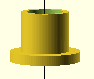
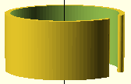
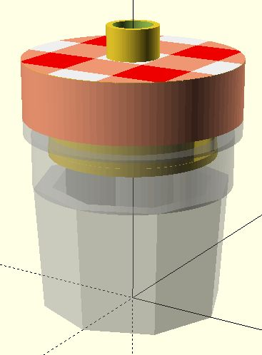
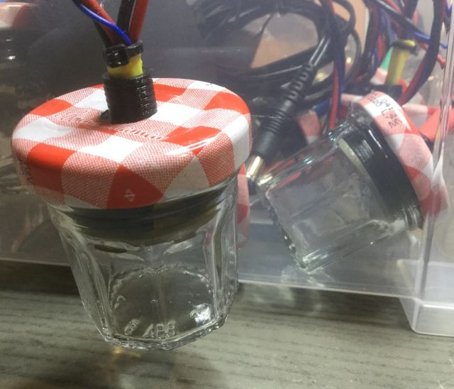
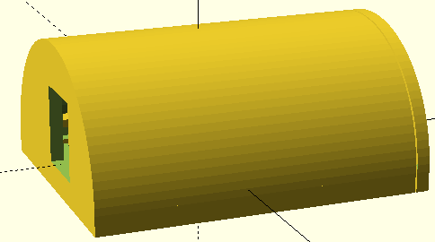

== 3d Printed Parts

All Parts are designed using OpenSCAD.

=== single jam jar

Drill a 10mm hole in the original cap and use  as a
bend protection. Wire the cables through and solder them in the PCB.
The  keep the distance between cap and the PCB. Use heat
shrinking tube and cable tie to fix it.

=== Controller

The Controller case has got two parts, just push the Controller PCB in at click the
cap on it.

