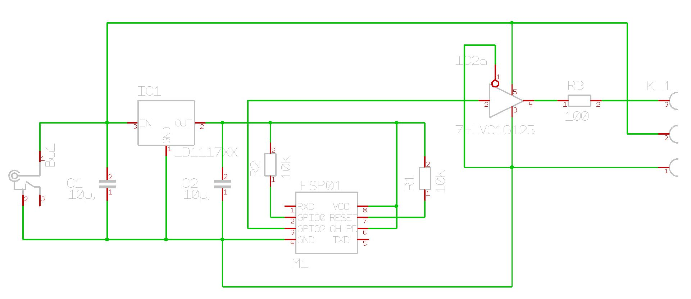

== PCB

The PCB is desiged using Target.

=== LED PCB

Straight forward schematic, just a serial resistor at input and output and a ceramic
capacity next to the WS2811.

I milled the PCB using my Stepcraft milling machine.

The grey color is because of a chemical tinning surface.

== Controller

The Controller is a ESP01 plugged in the PCB. You need an adapter to install the
software, before plugging it in the PCB.
The 74LVC1G125 us used to translate the 3.3V output to a 5V signal.

