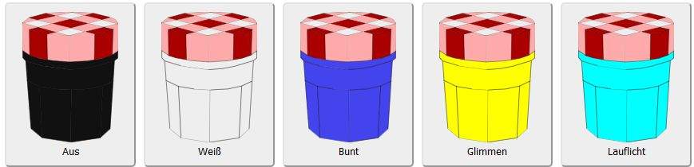

== Firmware

The Firmware is compiled using Platform IO.

The link:https://github.com/tzapu/WiFiManager[WifiManager] Library is used on startup to
allow the user to select a WiFi accespoint and configure it.  During this phase, all
LED's are red.

In Normal Mode the menu shows multiple options:

The lights can be turned off, only white, colored, a glowing effect or a running light.
